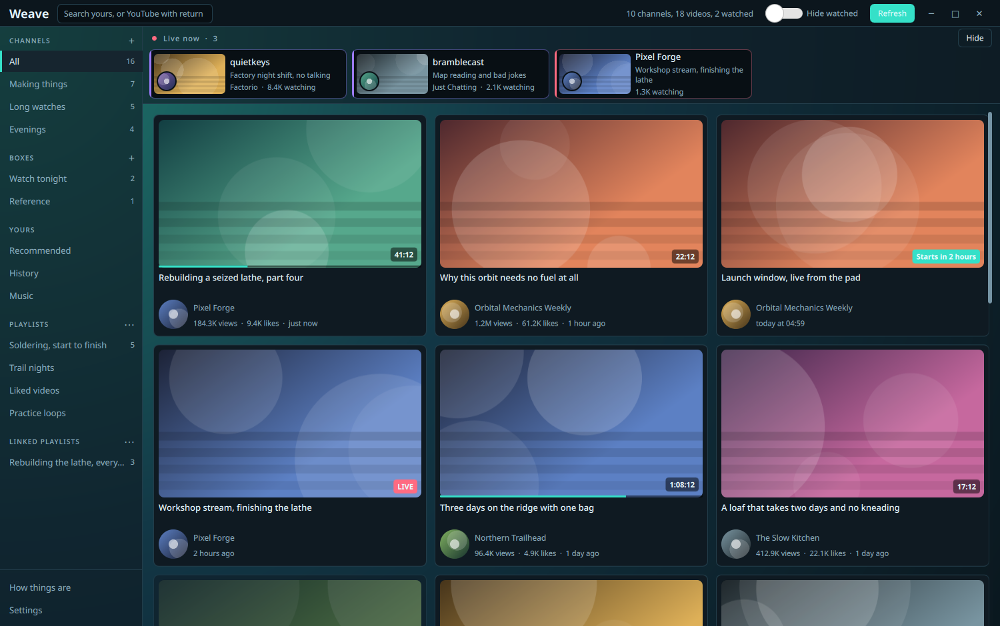
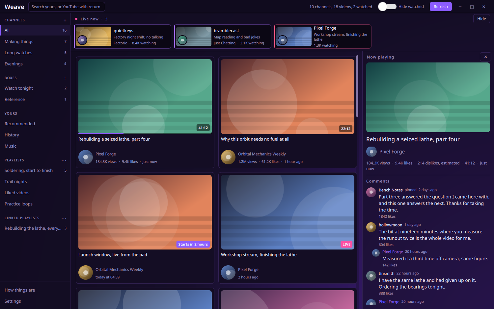
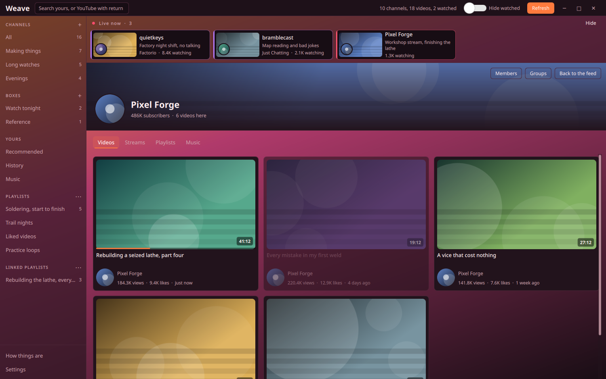
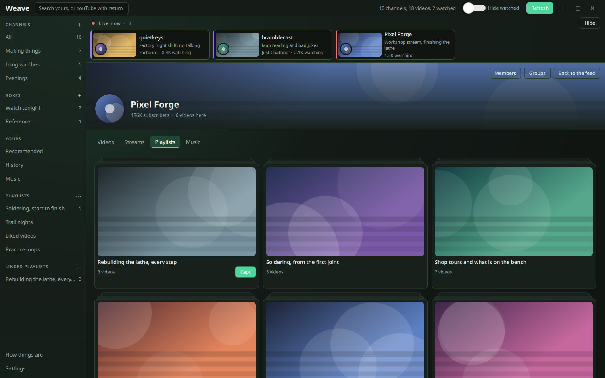
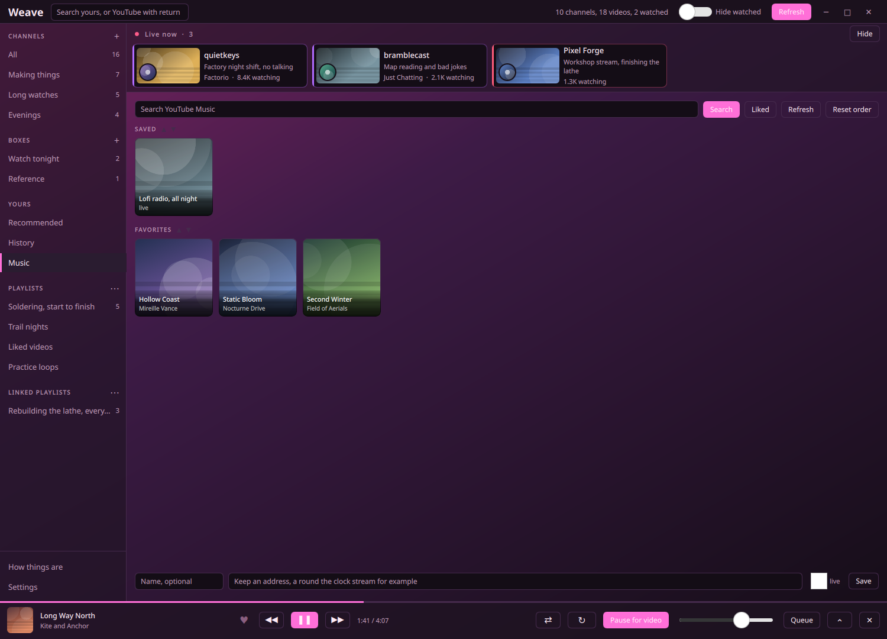
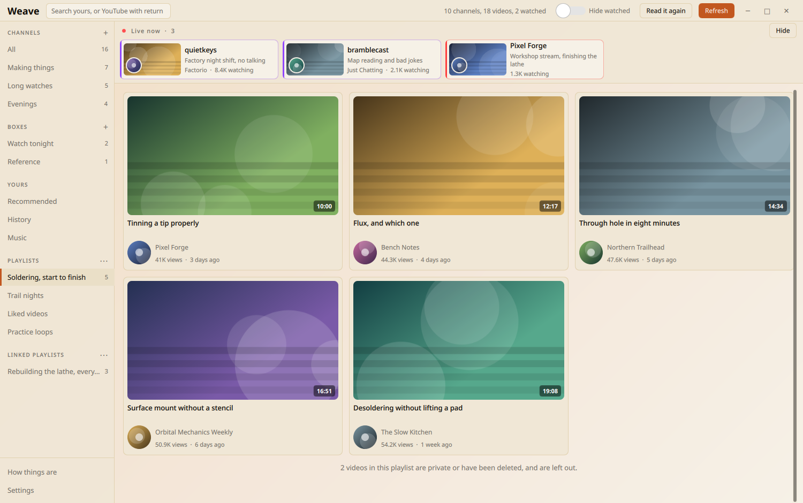
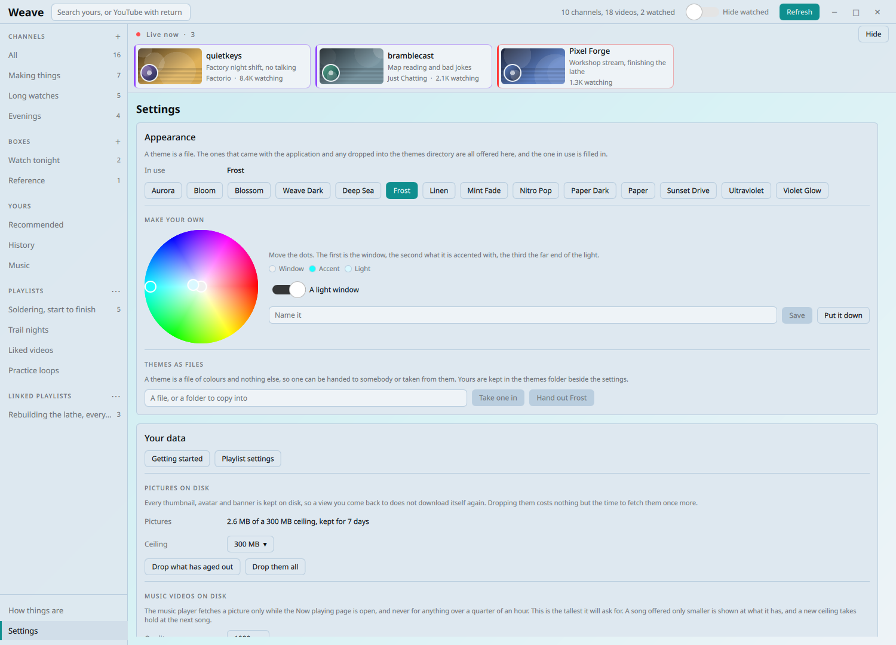

<h1> Weave</h1>

A personal YouTube and Twitch client for Linux. Weave shows what the channels
you track have posted, sorted into groups you make yourself, and hands playback
to `mpv` instead of embedding a player of its own. Music goes to a second `mpv`
with no window, driven from a player bar inside the app.

It is built for one person, which is a design choice rather than an apology.
Nothing recommends anything in the feed, nothing autoplays, and there is no
endless scroll of things you never asked for. Everything Weave knows sits in one
SQLite file in your own home directory, and it never writes to your account.



*The feed in Aurora. Groups and boxes down the left, whoever is
streaming along the top, and a line under a card showing where you stopped.*

## What it does

* A feed built from each channel's own RSS, which needs no login and carries
  exact publish times with exact view and like counts
* Lengths are filled in behind the feed, since RSS carries none, a channel at a
  time off its own listings, so a library read in from a long backlog fills its
  gaps over the following hours instead of leaving them
* One command imports every channel you already subscribe to, names and pictures
  included, and any channel can be tracked without subscribing to it
* **Groups** hold whole channels, **boxes** hold individual videos, both made and
  named by you, both mixing YouTube and Twitch
* A live bar across the top, Twitch and YouTube in one row ordered by how many
  are watching, on its own faster timer
* Left click plays in `mpv`, and Weave watches that `mpv` over its IPC socket to
  learn what was watched, so hide watched means something without a second
  history to keep
* Shorts stay out of the feed, because each channel has one feed per tab and
  Weave asks for the long form one. A channel that has no long form tab is read
  from its mixed feed instead, and its Shorts tab is then read as well, so what
  came from it is known for what it is
* An announced premiere is badged with when it starts and is refused by the
  player rather than handed over to fail
* What is behind a channel membership lives in a feed of its own that nothing
  else carries. A button on that channel's page reads it, now rather than
  whenever the poller next comes round, and puts what it finds in a half of its
  own, and in any group that channel is in, since a group is a list built by
  hand. Press it again and everything already read stays where it is while
  nothing more is asked for. Those videos never reach the feed, they are badged
  wherever they do appear, and a press is refused unless the membership is one
  you hold. Whatever the answer was, the channel page says it
* Search everything stored as you type, or press enter to search YouTube itself
* What YouTube suggests, the history it keeps and your own playlists, each in its
  own place and never poured into the feed
* A detail panel that follows what `mpv` is playing, with views, likes, an
  estimated dislike count and the top comment threads
* A music area with its own player bar, a queue you can reorder, favourites, the
  listening it remembers, and media keys through MPRIS
* Themes are files, fourteen come with it, and there is an editor with a colour
  wheel that derives a whole palette from two dots
* A channel page in three parts, the videos, the streams it has made and the
  playlists, and a playlist you keep sits in the sidebar under your own
* A report written to one file from the How things are page, holding the checks,
  the versions, the counts and every request of the last day, and no channel
  names, no titles and nothing secret
* Its own window frame, mouse back and forward buttons, and a remembered shape

## What is playing



*Ultraviolet. The panel mirrors `mpv` rather than the grid, so it follows an
`mpv` side track change too. Views and likes are already stored and appear at
once, while the dislike estimate and the comments are fetched only for a video
somebody is actually looking at.*

Closing the panel closes it until the next video starts, and closing `mpv`
closes it as well, since there is then nothing to mirror. A Twitch stream shows
what a stream has instead, who is on, what they are playing, how many are
watching and how long it has been going.

## A channel on its own



*Sunset Drive. Clicking a channel name opens everything stored from it, watched
ones dimmed rather than hidden, since asking for a channel means asking for all
of it.*

A channel that streams gets a half of its own for the recordings. The videos
tab and the streams tab are separate lists at the source, so past streams used
to appear nowhere, and a recording is badged as one wherever it turns up, since
three hours of somebody sitting down for an evening is not a video and the
length alone never said so.

## The playlists a channel has made



*Mint Fade. A playlist is drawn as the stack of videos it is. The pictures come
with the listing, so a page of them costs the one request that read the tab
rather than a request each.*

Opening one reads it, which is also where its count comes from, because the
listing carries names and pictures and no count at all. Keeping a playlist puts
it in a section of its own in the sidebar, apart from yours, since it belongs to
somebody else and no reading of your own playlists knows anything about it.

## Music



*Bloom. The shelves YouTube Music itself opens on, favourites, saved
addresses for a round the clock stream, and a bar that survives switching views.*

Nothing is downloaded. `yt-dlp` resolves an address and a second `mpv` with no
window plays it, which reaches the same quality the rest of your setup gets.
Weave keeps the queue and hands that player only the track playing and the one
after it, and the next address is resolved as the current track starts, so a
changeover is a millisecond and going back a track costs nothing.

Starting a video pauses the music, fading out over about a second rather than
cutting off mid note. There is a switch in the bar if you disagree. Repeat has
three settings rather than two, off, the whole queue, and the one track.

## Your playlists



*Linen, one of the four light ones. A playlist keeps the order somebody gave
it, and entries that have gone private are counted at the foot of the list
rather than quietly making it shorter.*

Nothing is read at launch. The menu beside **Playlists** reads the list, which
carries no contents, and opening one reads that playlist. A long list would bury
everything under it, so each playlist can be hidden on its own and the order is
yours. Clicking a video hands `mpv` the whole playlist starting there, so the
next one follows. A playlist can also be marked as music, after which a press on
one of its videos goes to the player bar instead.

## Themes



*Frost, another of them. Every theme in the list is a file in the same format
as one you write, and the window repaints as you save it.*

Move two or three dots on the wheel and all sixteen colour roles follow, with
text moved until it clears a contrast ratio, in whichever direction reaches
further on that ground. Save it and it lands in `~/.config/weave/themes` as
ordinary TOML, ready to hand to somebody else.

```sh
python -m weave themes
python -m weave themes use Frost
python -m weave themes export Frost
```

## Requirements

Everything here is in the Arch official repositories, and in the package manager
of most other distributions.

| Needed for | Package |
|---|---|
| The application | `python`, `pyside6`, `python-requests`, `python-platformdirs` |
| Playback | `mpv` |
| Adding a channel, and anything beyond RSS | `yt-dlp`, plus `deno` or `nodejs` for the challenges it has to solve |
| Twitch playback | `streamlink` |
| The music area | `python-ytmusicapi` |

## Install

Run it straight from a clone.

```sh
git clone https://github.com/Tobias2909/Weave.git
cd Weave
python -m weave
```

Or install it as a normal program.

```sh
pipx install git+https://github.com/Tobias2909/Weave
weave-app
```

Weave draws its own window frame, so a panel takes the name and the icon from a
desktop entry rather than from the window. Write that entry and the icons into
your own share tree, which touches nothing outside your home directory and needs
no root.

```sh
python -m weave desktop install
```

A word about the name. TeX Live ships a program called weave as well, its
literate programming tool, so on a machine carrying both, whichever comes first
on your path wins. That is why this one also installs as `weave-app`, which is
always this program, and why `python -m weave` always works.

## Use

Everything is done in the window. The first start opens a few pages that walk you
through it, one to import your subscriptions, one to connect Twitch, one to try
the themes on and one that says how the rest is used. They stop appearing once
the subscriptions are imported and Twitch is connected, the box in their corner
stops them sooner, and the **Getting started** button on the settings page opens
them again whenever you want.

**Import subscriptions** lives on that page as well. It reads your subscription
list and tracks every channel in it. One at a time goes through the plus beside
**Channels** in the panel, which offers **Follow a channel** and **New group**,
and a channel takes a handle, a channel id, a channel address or a `twitch.tv`
address. A bare word with no `@` and no URL around it is refused on purpose,
because it could be a Twitch login or a YouTube name, and guessing would turn a
typo into a tracked channel.

The plus beside **Channels** makes a group, the plus beside **Boxes** makes a
box, and either can be renamed, moved or deleted by right clicking its row.
Right click a card for the same sort of menu, which plays it, opens its channel,
marks it watched or puts it in a box. Deleting a group keeps its channels and
deleting a box keeps its videos. A group is read three ways. **All**, **Videos** and **Streams** sit over its cards and say which of them is wanted, every group keeps its own answer, and the row steps out of the way as you scroll down and comes back the moment you turn round.

For Twitch, press **Connect Twitch** in the live bar and approve the page it
opens, which already has the code filled in, so there is nothing to type and
nothing to register. Every channel you follow is tracked from that moment. Weave
comes with its own Twitch application, because a client id is public by design
and the login used here has no client secret anywhere in it.

There is a command behind most of it as well, for a script or for setting a
machine up over ssh, and it can list itself.

```sh
python -m weave --help
```

## How playback works

Weave never decodes a video. It resolves nothing and downloads nothing. It hands
a URL to `mpv` and reads that instance over its JSON IPC socket to learn what was
watched, either at the end of a file or once 85 percent of it has been seen.

When `mpv-ff2mpv-single.sh` is on your path Weave calls it, because that wrapper
already canonicalizes URLs, resolves Twitch through `streamlink`, expands
playlists and reuses one instance. Without it Weave falls back to plain `mpv` and
everything still works, minus those extras. Nothing is added to your `mpv`
configuration, no Lua script and no config edit. The only coupling is a command
name and a socket path, both of which you can change.

That wrapper comes from the `mpv` setup Weave was built beside, which is at
[`Tobias2909/mpv-config`](https://github.com/Tobias2909/mpv-config) together with
the upscaling shaders, the live chat overlay, subtitle translation and the rest
of it. Weave needs none of it, and with plain `mpv` on your path everything here
works.

One part of that setup is worth copying even if you take nothing else. It hands
`yt-dlp` the `mark-watched` option, which sends the playback ping that puts a
video into your own YouTube history. Weave itself never writes to your account,
so without something doing that, Google is told nothing about what you watched
and the suggestions it makes you go stale over time. That ping is your player
reporting your own viewing, exactly as the site would have.

## How often it asks

Weave takes a small round every minute rather than a large one every quarter of
an hour, because what the feed endpoint objects to is a burst rather than a day
of requests, and it says so by refusing rather than by asking you to wait. Each
channel carries its own interval worked out from how recently it published, from
a quarter of an hour for one that posted this week down to once a day for one
silent for a year. A quarter of an hour is the floor, since the feed answers with
`max-age=900` and asking sooner returns the same body.

Most channels are not asked on that schedule at all. Every quarter of an hour one
call reads your subscriptions feed, the newest thousand videos across everything
you follow, and any channel it names with something new is asked in the same
minute. A channel that call covers is otherwise asked only every six hours, to
refresh its view and like counts, since anything new from it arrives through the
sweep first. Should the sweep stop answering for half an hour, every channel falls
back to its own interval until it returns. The page called How things are says
how many channels the sweep covers and when it last answered.

None of that would catch a dormant channel posting again, so one paginated sweep
of your subscriptions runs alongside it, and any video in it Weave has never seen
puts its channel at the front of the queue. Underneath sits a ceiling per
endpoint, counted in the database so restarting cannot forget it, well above what
ordinary polling spends.

```sh
python -m weave budget
python -m weave schedule
```

## When nothing is arriving

Every way this can fail looks the same from outside, so one place asks each part
whether it is working and prints the answer.

```sh
python -m weave doctor
python -m weave doctor --offline
```

It checks the tools, the browser profile and whether it still holds a login, the
database, the schedule, what each endpoint has been asked lately, the picture
cache, Twitch, and the feed endpoint itself. Only the last two make a request and
`--offline` leaves them out. It exits nonzero when something is really broken, so
it can be run from a script. **How things are** in the sidebar is the same list
in the window, with a table of when each channel was last asked and when it is
next due, in the order the poller will take them.

## Configuration and where things live

Copy `config.example.toml` to `~/.config/weave/config.toml` and edit it. Every
value in that file is already the default, so an empty config is valid and a
missing one is fine.

| What | Where |
|---|---|
| Config | `~/.config/weave/config.toml` |
| Themes | `~/.config/weave/themes/` |
| Database | `~/.local/state/weave/weave.db` |
| Pictures | `~/.cache/weave/images/` |

Cookies are only needed for the parts that go beyond RSS. Weave reads them the
way `yt-dlp` does, from a browser profile you point it at. Firefox family
browsers work with nothing extra. Chromium family browsers need the desktop
keyring and are untested here. None of your data is in the repository and none of
it is ever sent anywhere.

## Tests

The tests are plain `unittest`, so they need nothing installed.

```sh
python -m unittest discover -s tests -t .
ruff check .
```

They cover the parts where a silent mistake would be expensive, and every
background worker is run once with its source stubbed, because a worker that
reads an attribute its constructor never set raises nothing until it meets the
network. The window is tested too, in its own process, booted on the offscreen
platform against a scratch home and walked through every view, menu and popup
with every request failing at once, since a clean boot proves almost nothing
about an interface.

```sh
python tools/drive.py smoke --offline --screenshot /tmp/weave.png
python tools/shots.py --out docs/shots
```

The second one takes the pictures in this file. Every name, title, number and
thumbnail in them is invented in that script, and each is taken in a scratch home
of its own with the network stubbed out, so a picture of the application never
carries anybody's account.

## Not an official anything

Weave is one person's own program. It is not made by, endorsed by or connected to
YouTube, Google or Twitch in any way, and it names those services only to say
which one a video came from.

## A note on how this talks to YouTube

Weave reads. It never writes to your account, no likes, no subscriptions, no
comments, no playlist edits. Reading a public feed and playing a video outside
their player is the line every external client sits on, and the same line your
`mpv` and `yt-dlp` setup already sits on. Writing would mean impersonating your
browser to change your own account, which is not worth the risk for a feed
reader.

## License

MIT. See [LICENSE](LICENSE).
