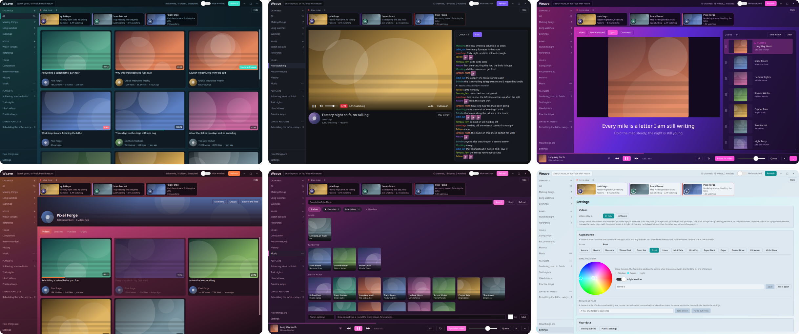

<h1> Weave</h1>

[](https://github.com/Tobias2909/Weave/actions/workflows/tests.yml)
[](https://github.com/Tobias2909/Weave/releases/latest)

A personal YouTube and Twitch client for Linux. Weave shows what the channels
you follow have posted, sorted into groups you make yourself, and plays it in
its own window or in your `mpv`. Music has a player of its own.

Nothing recommends anything in the feed, nothing autoplays, and everything
Weave knows sits in one SQLite file in your home directory.

https://github.com/user-attachments/assets/1bf1764e-1f51-4d7b-8c48-599ce9d67333

## Features

* A feed of the YouTube and Twitch channels you follow, taken from your own
  subscriptions, with Shorts left out
* **Groups** sort whole channels and **boxes** keep single videos, both made and
  named by you
* Videos play in the window with a queue, chapters, captions, live chat and
  SponsorBlock, and keep playing in a corner while you browse. Your own `mpv`
  can play them instead
* YouTube Premium quality whenever your account has it
* A live bar with everyone streaming right now, Twitch and YouTube in one row
* A music player with the shelves of YouTube Music, a queue, favourites, boxes
  of songs, lyrics that follow the song and media keys
* What YouTube recommends, your history and your playlists, each in its own
  place and never mixed into the feed
* Search what is stored as you type, or YouTube itself with return
* A panel beside the feed with views, likes, an estimated dislike count and the
  top comments
* Fourteen themes, and an editor that builds a whole theme from three dots on a
  colour wheel

## Screenshots



*The feed, a stream with its chat, a song with its lyrics, a channel, the music
shelves and the theme editor, each in another of the fourteen themes.*

## Install

Weave needs `python`, `pyside6`, `python-requests`, `python-platformdirs`,
`mpv`, `yt-dlp` with `yt-dlp-ejs` and `deno`, `streamlink` for Twitch and
`python-ytmusicapi` for the music. All of them are in the Arch repositories and
in most other distributions. Where `yt-dlp-ejs` is not packaged,
`python3 -m pip install --user yt-dlp-ejs` puts it where `yt-dlp` looks.

```sh
pipx install --system-site-packages "weave[music] @ git+https://github.com/Tobias2909/Weave"
weave-app desktop install
weave-app
```

The second line puts Weave in your application menu. Weave signs in through a
browser you already use YouTube in, and Twitch is connected with one button. The
first start walks you through both and imports your subscriptions, and
`weave-app doctor` says which part is missing when nothing arrives.

Or run it straight from a clone.

```sh
git clone https://github.com/Tobias2909/Weave.git
cd Weave
python -m weave
```

## Not an official anything

Weave is one person's own program and is not made by, endorsed by or connected
to YouTube, Google or Twitch. It reads your account and writes nothing to it
unless you ask. Skipping sponsors uses data from
[SponsorBlock](https://sponsor.ajay.app), shared under
[CC BY-NC-SA 4.0](https://creativecommons.org/licenses/by-nc-sa/4.0/).

## License

MIT. See [LICENSE](LICENSE).
